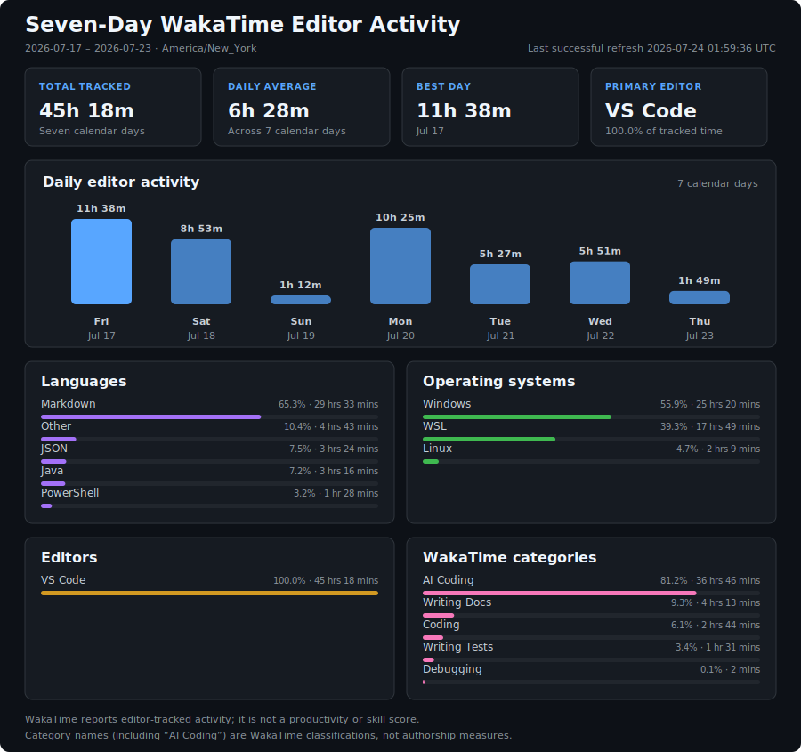

# Chad Reesey | reesey275 | Mr. Potato

[!NOTE]
> I'm a United States Air Force veteran and an IT and systems professional.
> My professional experience since 2007 includes systems administration,
> automation, Windows scripting, SharePoint portal development, systems
> integration, and multi-site technology deployment.
> I am the founder and CEO of The Angry Gamer Show Productions, LLC (TAGS).

## Capability Badges

**Current Focus:** Platform Engineering · Infrastructure Architecture · DevOps Automation ·
Security/Governance · AI-Enhanced Engineering

### Core Languages & Formats

[![Python][python-badge]][python]
[![TypeScript][ts-badge]][typescript]
[![JavaScript][js-badge]][javascript]
[![Bash][bash-badge]][posix]
[![SQL][sql-badge]][sql]
[![Markdown][markdown-badge]][markdown]
[![YAML][yaml-badge]][yaml]
[![JSON][json-badge]][json]

### Active Learning

[![Java][java-badge]][java]

### Backend & APIs

[![FastAPI][fastapi-badge]][fastapi]
[![Node.js][node-badge]][node]
[![Fastify][fastify-badge]][fastify]
[![Express][express-badge]][express]
[![Discord API][discord-badge]][discord-api]
[![MCP SDK][mcp-badge]][mcp]

### DevOps & Infrastructure

[![Docker][docker-badge]][docker]
[![Docker Compose][compose-badge]][docker-compose]
[![GitHub Actions][actions-badge]][actions]
[![Terraform][terraform-badge]][terraform]
[![Ansible][ansible-badge]][ansible]
[![Traefik][traefik-badge]][traefik]
[![Cloudflare][cloudflare-badge]][cloudflare]
[![TrueNAS SCALE][truenas-badge]][truenas]

### Frontend

[![React][react-badge]][react]
[![Vite][vite-badge]][vite]
[![Tailwind CSS][tailwind-badge]][tailwind]
[![shadcn/ui][shadcn-badge]][shadcn]

### Security & Governance

[![OAuth2][oauth-badge]][oauth]
[![JWT][jwt-badge]][jwt]
[![RBAC][rbac-badge]][rbac]
[![Active Directory][ad-badge]][active-directory]
[![Secrets][secrets-badge]][secrets]
[![Quality Gates][quality-badge]][quality-gates]

### AI & Automation

[![OpenAI][openai-badge]][openai]
[![GitHub Copilot][copilot-badge]][copilot]
[![Codex][codex-badge]][codex]
[![MCP Servers][mcp-servers-badge]][mcp]
[![Prompt-Driven Workflows][prompt-badge]][prompt-workflows]

### Systems Operations

[![Linux][linux-badge]][linux]
[![Windows][windows-badge]][windows]
[![WSL][wsl-badge]][wsl]
[![PowerShell][powershell-badge]][powershell]
[![Virtualization][virtualization-badge]][virtualization]

### Data

[![PostgreSQL][postgres-badge]][postgres]
[![Redis][redis-badge]][redis]
[![MySQL][mysql-badge]][mysql]
[![Supabase][supabase-badge]][supabase]

[python-badge]: https://img.shields.io/badge/Python-3.12-3776AB?logo=python&style=flat
[python]: https://www.python.org/
[ts-badge]: https://img.shields.io/badge/TypeScript-5.x-3178C6?logo=typescript&style=flat
[typescript]: https://www.typescriptlang.org/
[js-badge]: https://img.shields.io/badge/JavaScript-ES2023-F7DF1E?logo=javascript&style=flat
[javascript]: https://developer.mozilla.org/docs/Web/JavaScript
[bash-badge]: https://img.shields.io/badge/Shell-POSIX%2FBash-4EAA25?logo=gnubash&style=flat
[posix]: https://pubs.opengroup.org/onlinepubs/9699919799/
[sql-badge]: https://img.shields.io/badge/SQL-Query%20Language-336791?style=flat
[sql]: https://en.wikipedia.org/wiki/SQL
[markdown-badge]: https://img.shields.io/badge/Markdown-Documentation-1F2937?logo=markdown&logoColor=white&style=flat
[markdown]: https://www.markdownguide.org/
[yaml-badge]: https://img.shields.io/badge/YAML-Workflow%20Config-CB171E?logo=yaml&style=flat
[yaml]: https://yaml.org/
[json-badge]: https://img.shields.io/badge/JSON-Data%20Format-4B5563?style=flat
[json]: https://www.json.org/json-en.html
[java-badge]: https://img.shields.io/badge/Java-Active%20Learning-ED8B00?logo=openjdk&style=flat
[java]: https://www.java.com/
[fastapi-badge]: https://img.shields.io/badge/FastAPI-Framework-009688?logo=fastapi&style=flat
[fastapi]: https://fastapi.tiangolo.com/
[node-badge]: https://img.shields.io/badge/Node.js-Runtime-5FA04E?logo=nodedotjs&style=flat
[node]: https://nodejs.org/
[fastify-badge]: https://img.shields.io/badge/Fastify-Framework-202020?logo=fastify&logoColor=white&style=flat
[fastify]: https://fastify.dev/
[express-badge]: https://img.shields.io/badge/Express-Framework-404D59?logo=express&logoColor=white&style=flat
[express]: https://expressjs.com/
[discord-badge]: https://img.shields.io/badge/Discord%20API-Integration-5865F2?logo=discord&style=flat
[discord-api]: https://discord.com/developers/docs/intro
[mcp-badge]: https://img.shields.io/badge/MCP-SDK-334155?style=flat
[mcp]: https://modelcontextprotocol.io/
[docker-badge]: https://img.shields.io/badge/Docker-Containerization-2496ED?logo=docker&style=flat
[docker]: https://www.docker.com/
[compose-badge]: https://img.shields.io/badge/Docker%20Compose-Orchestration-2496ED?logo=docker&style=flat
[docker-compose]: https://docs.docker.com/compose/
[actions-badge]: https://img.shields.io/badge/CI%2FCD-GitHub%20Actions-2088FF?logo=githubactions&style=flat
[actions]: https://docs.github.com/actions
[terraform-badge]: https://img.shields.io/badge/Terraform-IaC-7B42BC?logo=terraform&style=flat
[terraform]: https://www.terraform.io/
[ansible-badge]: https://img.shields.io/badge/Ansible-Automation-EE0000?logo=ansible&style=flat
[ansible]: https://www.ansible.com/
[traefik-badge]: https://img.shields.io/badge/Traefik-Proxy-24A1C1?logo=traefikproxy&style=flat
[traefik]: https://traefik.io/
[cloudflare-badge]: https://img.shields.io/badge/Cloudflare-Edge%2FTunnel-F38020?logo=cloudflare&style=flat
[cloudflare]: https://www.cloudflare.com/
[truenas-badge]: https://img.shields.io/badge/TrueNAS%20SCALE-Storage-0095D5?logo=truenas&style=flat
[truenas]: https://www.truenas.com/truenas-scale/
[react-badge]: https://img.shields.io/badge/React-UI-61DAFB?logo=react&style=flat
[react]: https://react.dev/
[vite-badge]: https://img.shields.io/badge/Vite-Build%20Tool-646CFF?logo=vite&style=flat
[vite]: https://vite.dev/
[tailwind-badge]: https://img.shields.io/badge/Tailwind%20CSS-Styling-06B6D4?logo=tailwindcss&style=flat
[tailwind]: https://tailwindcss.com/
[shadcn-badge]: https://img.shields.io/badge/shadcn%2Fui-Components-334155?style=flat
[shadcn]: https://ui.shadcn.com/
[oauth-badge]: https://img.shields.io/badge/OAuth2-Authorization-2563EB?style=flat
[oauth]: https://oauth.net/2/
[jwt-badge]: https://img.shields.io/badge/JWT-Tokens-2F2F2F?style=flat
[jwt]: https://jwt.io/
[rbac-badge]: https://img.shields.io/badge/RBAC-Access%20Control-6F42C1?style=flat
[rbac]: https://csrc.nist.gov/projects/role-based-access-control
[ad-badge]: https://img.shields.io/badge/Active%20Directory-Identity-0078D4?logo=microsoft&style=flat
[active-directory]: https://learn.microsoft.com/en-us/windows-server/identity/ad-ds/get-started/virtual-dc/active-directory-domain-services-overview
[secrets-badge]: https://img.shields.io/badge/Secrets-Management-15803D?style=flat
[secrets]: https://docs.github.com/en/actions/how-tos/write-workflows/choose-what-workflows-do/use-secrets
[quality-badge]: https://img.shields.io/badge/Quality%20Gates-CI%20Governance-2088FF?logo=githubactions&style=flat
[quality-gates]: https://docs.github.com/en/actions/how-tos/write-workflows/choose-what-workflows-do/use-jobs
[openai-badge]: https://img.shields.io/badge/OpenAI-Custom%20GPTs-412991?logo=openai&logoColor=white&style=flat
[openai]: https://openai.com/
[copilot-badge]: https://img.shields.io/badge/GitHub%20Copilot-AI%20Pairing-2EA44F?style=flat
[copilot]: https://github.com/features/copilot
[codex-badge]: https://img.shields.io/badge/Codex-Assisted%20Planning-412991?logo=openai&logoColor=white&style=flat
[codex]: https://openai.com/codex/
[mcp-servers-badge]: https://img.shields.io/badge/MCP%20Servers-Tooling-334155?style=flat
[prompt-badge]: https://img.shields.io/badge/Prompt--Driven-Workflows-EA580C?style=flat
[prompt-workflows]: https://platform.openai.com/docs/guides/prompting
[linux-badge]: https://img.shields.io/badge/Linux-Administration-FCC624?logo=linux&style=flat
[linux]: https://www.linux.org/
[windows-badge]: https://img.shields.io/badge/Windows-Administration-0078D4?logo=windows&style=flat
[windows]: https://www.microsoft.com/windows/
[wsl-badge]: https://img.shields.io/badge/WSL-Linux%20on%20Windows-4D4D4D?logo=linux&style=flat
[wsl]: https://learn.microsoft.com/windows/wsl/
[powershell-badge]: https://img.shields.io/badge/PowerShell-Automation-5391FE?logo=powershell&style=flat
[powershell]: https://learn.microsoft.com/powershell/
[virtualization-badge]: https://img.shields.io/badge/Virtualization-Operations-64748B?style=flat
[virtualization]: https://en.wikipedia.org/wiki/Virtualization
[postgres-badge]: https://img.shields.io/badge/PostgreSQL-Database-4169E1?logo=postgresql&style=flat
[postgres]: https://www.postgresql.org/
[redis-badge]: https://img.shields.io/badge/Redis-Cache-FF4438?logo=redis&style=flat
[redis]: https://redis.io/
[mysql-badge]: https://img.shields.io/badge/MySQL-Database-4479A1?logo=mysql&style=flat
[mysql]: https://www.mysql.com/
[supabase-badge]: https://img.shields.io/badge/Supabase-Platform-3FCF8E?logo=supabase&style=flat
[supabase]: https://supabase.com/
[github-stats]: ./profile/github-stats.svg
[top-languages]: ./profile/top-languages.svg
[profile]: https://github.com/reesey275

<!-- Optional ASCII header -->
## 🥔 Chad Reesey — Mr. Potato

## 🚀 About Me
- More than **25 years of hands-on computing and infrastructure experience**
- Professional systems-administration, automation, and software-development
  experience beginning in **2007**
- **United States Air Force veteran** — active duty from August 10, 2000,
  through March 28, 2012; honorable service
- Founder and CEO of The Angry Gamer Show Productions, LLC, a United States
  Air Force veteran-owned and operated Florida company
- Currently operating the TAGS build phase as an **AI-assisted solo human operator**
- I build thinking systems: **visible learning → doctrine → automation**

## 🧭 Engineering Philosophy
I build systems the way mission-critical operations demand they be built:
- Structure over improvisation
- Accountability over ambiguity
- Correctness over cleverness
- Documentation over assumptions
- Automation over heroics

If a system requires tribal knowledge to function, it is already a liability.

## 🔧 How I Work
- Written context before decisions; initial meetings are used for scoping and discovery when requirements are still
  forming
- Bias toward observable, repeatable, resilient systems
- Deterministic CI, linting, documentation validation, and reproducible builds
- Clear standards, direct feedback, and auditability over hand-waving

## 📊 GitHub Stats

- **Core Languages & Formats:** Python • TypeScript • JavaScript • Bash • SQL • Markdown • YAML • JSON
- **Active Learning:** Java
- **Organization:** [The Angry Gamer Show Productions](https://github.com/theangrygamershowproductions)

### GitHub Contribution Activity

Note: Contribution activity reflects a current build phase operated by one human
using AI-assisted tools. It does not imply sole authorship of every historical
commit, dependency, generated output, or third-party component.

These cards use public GitHub REST data only. Code composition is calculated
from GitHub Linguist source-code bytes across public, non-fork projects,
excludes this profile repository, and is not a proficiency ranking.

[![GitHub Stats][github-stats]][profile]

[![Public Project Code Composition][top-languages]][profile]

## 📈 Seven-Day Editor Activity

WakaTime reports editor-tracked activity from the last successful
seven-calendar-date window. It is workflow context rather than a measure of
productivity, skill, or authorship. Labels such as "AI Coding" are WakaTime
classifications; they do not identify who or what authored the work. If a
refresh fails, the last successful
snapshot and its timestamp remain visible. The most recent date may contain a
partial day at refresh time. Project names are intentionally omitted from the
public output.

<!--START_SECTION:waka-->

View seven-day editor activity data

- **Time Zone:** America/New\_York
- **Reporting Window:** 7 inclusive calendar dates (latest may be partial)
- **Date Range:** 2026-07-15 - 2026-07-21
- **Total Tracked:** 49 hrs 20 mins
- **Daily Average:** 7 hrs 2 mins
- **Best Day:** 2026-07-17 (11 hrs 38 mins)

### Languages

- Markdown: 29 hrs 49 mins (60.46%)
- PowerShell: 5 hrs 33 mins (11.28%)
- Other: 5 hrs 19 mins (10.79%)
- JSON: 3 hrs 13 mins (6.53%)
- Java: 2 hrs 12 mins (4.46%)

### Editors

- VS Code: 49 hrs 20 mins (100.00%)

### Operating Systems

- Windows: 31 hrs 10 mins (63.20%)
- WSL: 16 hrs 46 mins (33.99%)
- Linux: 1 hr 23 mins (2.81%)

### Categories

- AI Coding: 42 hrs 18 mins (85.75%)
- Writing Docs: 3 hrs 20 mins (6.76%)
- Coding: 2 hrs 34 mins (5.21%)
- Writing Tests: 1 hr 5 mins (2.20%)
- Debugging: 2 mins (0.08%)

_Category names, including "AI Coding," are WakaTime classifications and do not measure authorship._

_Last successful refresh: 2026-07-22 01:56:25 UTC_
<!--END_SECTION:waka-->

## 🎯 Featured Projects

### [DevOnboarder](docs/PROJECTS/DevOnboarder.md)

**Overview:** Multi-service onboarding-automation project with Discord, web,
and CI/CD components.

**Stack:** Python • Shell (POSIX/Bash) • FastAPI • Discord API • GitHub Actions

**Public components:** Onboarding workflows, web and API services, Discord
integration, documentation checks, and GitHub Actions automation.

---

### [TAGS Ecosystem](docs/PROJECTS/TAGS-Ecosystem.md)

**Overview:** The current TAGS build phase brings together software,
automation, documentation, and infrastructure projects operated under The
Angry Gamer Show Productions, LLC.

**Stack:** Python • TypeScript • Shell (POSIX/Bash) • Docker • GitHub Actions

**Operating model:** Founder and CEO; AI-assisted solo human operator during
the current build phase. Delivered work is distinguished from plans and
experiments in the project overview.

---

### [SquirrelFocus](docs/PROJECTS/SquirrelFocus.md) | [Repository](https://github.com/reesey275/squirrelfocus)

**Overview:** Python command-line productivity and reflection toolkit for
short work-session notes and supporting documentation.

**Stack:** Python • Shell (POSIX/Bash)

---

### [Whisper Project](docs/PROJECTS/WhisperProject.md) | [Repository](https://github.com/reesey275/whisper-project)

**Overview:** Transcription utilities with local, Docker, and optional cloud-API
processing paths, including batch and optional GPU workflows. Local processing
is available when cloud services are not desired.

**Stack:** Python • Whisper • Docker • Optional cloud API

---

### Personal tooling

- [spotify-dev-toolkit](https://github.com/reesey275/spotify-dev-toolkit) — Spotify playlist tooling with an Express
  backend, browser interface, and Python export utility.
- [tags-workflows](https://github.com/theangrygamershowproductions/tags-workflows) — public reusable GitHub Actions
  workflows for organization repositories.
- [core-instructions](docs/PROJECTS/core-instructions.md) _(private repository)_ — documentation project for engineering
  policies, review processes, security guidance, and agent instructions.

## Abilities

I build infrastructure-backed software systems with an emphasis on platform
reliability, security boundaries, automation, and maintainable engineering
workflows.

- **Languages & Formats:** Python, TypeScript, JavaScript, Bash, SQL, Markdown,
  YAML, JSON
- **Frontend:** React, Vite, Tailwind CSS, shadcn/ui
- **Backend/API:** Node.js, Fastify, FastAPI, Express, REST APIs, Discord API,
  MCP SDK
- **DevOps & Infrastructure:** Docker, Docker Compose, GitHub Actions, Traefik,
  Cloudflare Tunnel, TrueNAS SCALE
- **Security & Governance:** OAuth2, JWT, RBAC, Active Directory, secret
  management, CI quality gates, documentation validation
- **Data:** PostgreSQL, Redis, MySQL, Supabase
- **AI-Enhanced Engineering:** OpenAI Custom GPTs, GitHub Copilot,
  Codex-assisted planning, MCP servers, prompt-driven workflows
- **Systems Operations:** Windows/Linux administration, virtualization, patching,
  troubleshooting, service reliability, and infrastructure documentation

**[📖 Complete Stack History](docs/STACK_HISTORY.md)** — Full technology exposure and systems experience
(historical breadth vs current daily usage)

## 🎓 Continuous Learning

- **Western Governors University** — currently enrolled in the Bachelor of
  Science, Software Engineering program
- **National Society of Leadership and Success (NSLS)** — member since 2025;
  completed the Foundations of Leadership program and earned the NSLS Advanced
  Leadership Certificate in May 2025
- **Microsoft Learn** — professional development during 2024–2025 covering
  Azure architecture, networking, governance, application hosting, ASP.NET
  Core, and introductory AI and machine-learning concepts

## 🌐 Connect With Me

- **🏢 Company:** [The Angry Gamer Show Productions](https://theangrygamershow.com)
- **💼 LinkedIn:** [in/chad-reesey](https://linkedin.com/in/chad-reesey)
- **🐦 Twitter/X:** [@reesey275](https://x.com/reesey275)
- **📘 Facebook:** [Reesey275](https://facebook.com/Reesey275)
- **📸 Instagram:** [reesey275](https://instagram.com/reesey275)
- **📧 Email:** [reesey.chad@outlook.com](mailto:reesey.chad@outlook.com)
- **📍 Location:** Space Coast, Florida, United States

## 📋 Resources

- [📄 Resume](resume/resume.md) — Professional background and experience
- [🧠 Philosophy](PHILOSOPHY.md) — Core methodology and approach
- [📚 Journal Index](docs/Journal_Index.md) — Learning documentation
- [🔍 AAR Index](docs/AAR_Index.md) — After Action Reports

> _"We practice in public so others can perform in peace."_

**Availability:** Open to serious, role-specific professional opportunities
and professionally presented inquiries.
