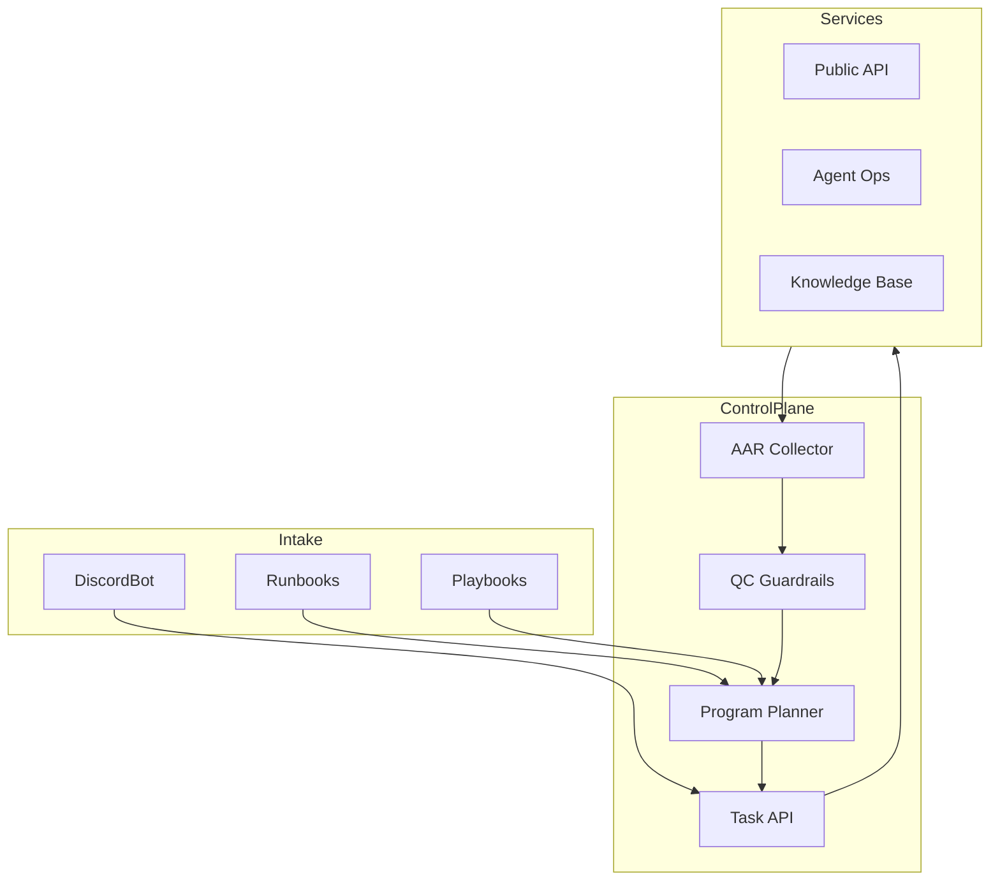

# Architecture

DevOnboarder coordinates onboarding across the platform's public API, agent
workflows, Discord bot, and knowledge services. The control plane exposes a
consistent lifecycle for teams that need to bootstrap new contributors, and it
enforces the automation guardrails that underpin the 95% quality threshold.

1. Runbooks, playbooks, and Discord interactions feed the control plane with
   role-specific onboarding requirements.
2. The program planner sequences those requirements into the three onboarding
   phases and pushes structured tasks through the Task API.
3. Services provide execution feedback that is captured as after action
   reports (AARs). The guardrail layer blocks rollouts that fall below the 95%
   success threshold and opens QC follow-up tasks until the deficit is closed.
