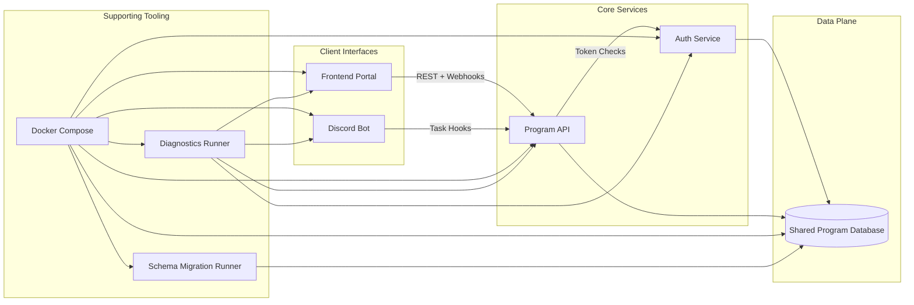

# Architecture

DevOnboarder runs as a collection of services that share a common automation
surface: the public API, a dedicated auth service, the Discord bot that fronts
onboarding, and the web frontend used by coordinators. Each service persists
state in the shared program database and relies on supporting tooling that keeps
the environment reproducible and observable.

Docker Compose anchors the automation surface by building and wiring every
service, database dependency, and operational task through a single invocation.
Migrations run inside the Compose project so schema updates travel with the same
images that ship to production, keeping the API, auth layer, and bots aligned
with the latest data model. The diagnostics runner executes in that shared
environment to probe REST, webhook, and auth flows, catching integration drift
early so onboarding automation stays reliable for new contributors.
