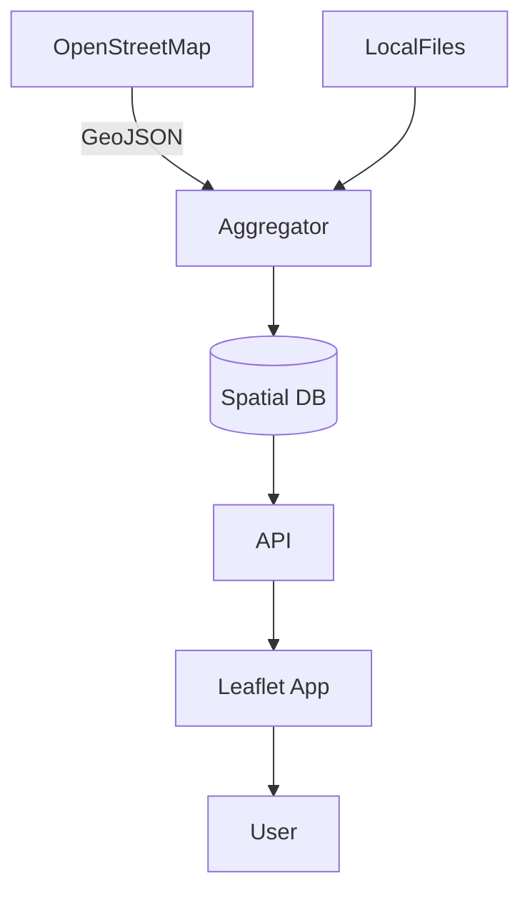

# Architecture

DevonBoarder stitches together mapping data from multiple sources.

Data flows from OpenStreetMap and local files into an aggregation service
that stores routes and points of interest. The API serves this data to a
Leaflet-based front end so users can explore the coastline.
