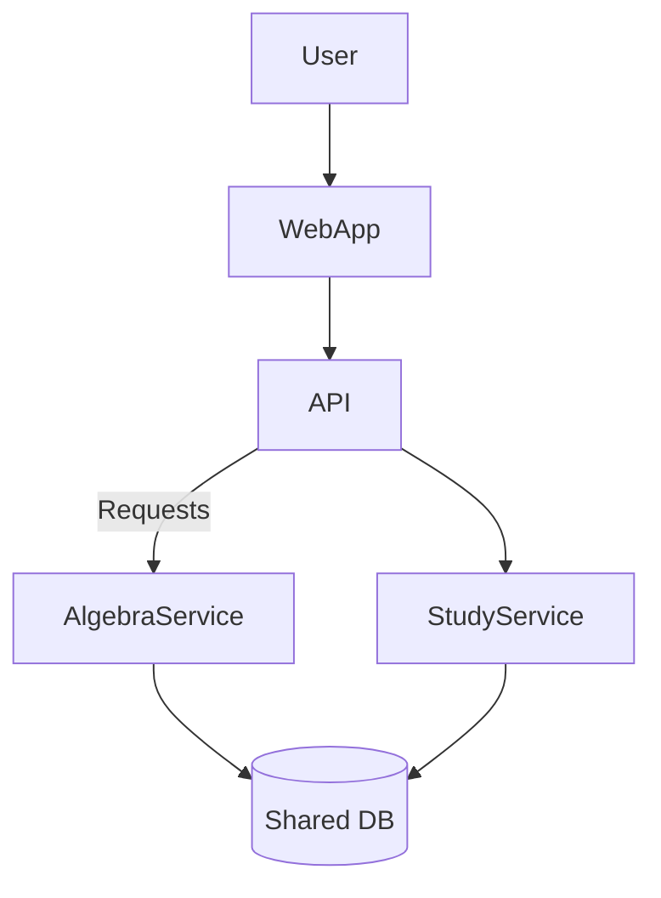

# Architecture

Education Tools uses a small API gateway to route traffic to different micro apps.

Each learning tool runs as its own service behind the gateway. Data is stored in
a shared database so new features can be added without changing the overall flow.
