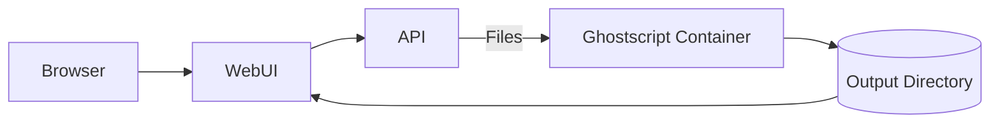

# Architecture

The UI connects to a containerized Ghostscript service that handles document conversions.

Users upload documents through the web interface. The API passes the files to the
container running Ghostscript. Converted output is stored and returned to the user.
