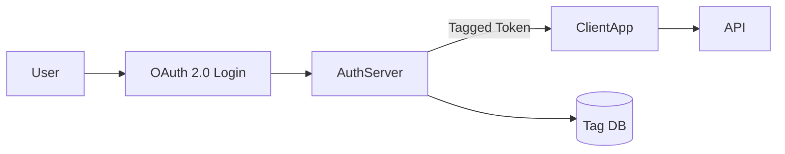

# Architecture

The server issues tag-based tokens for API access.

Users authenticate via OAuth. The auth server retrieves tag definitions from the
database and returns a token containing those tags. Client applications use the
token when calling APIs so access rules can be enforced.
